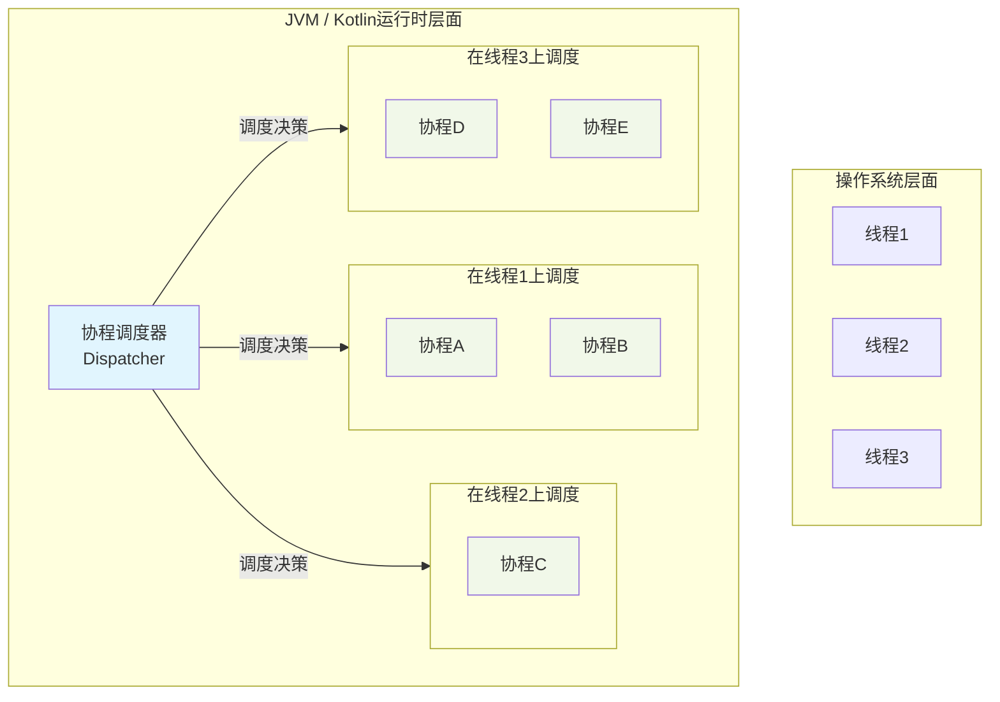
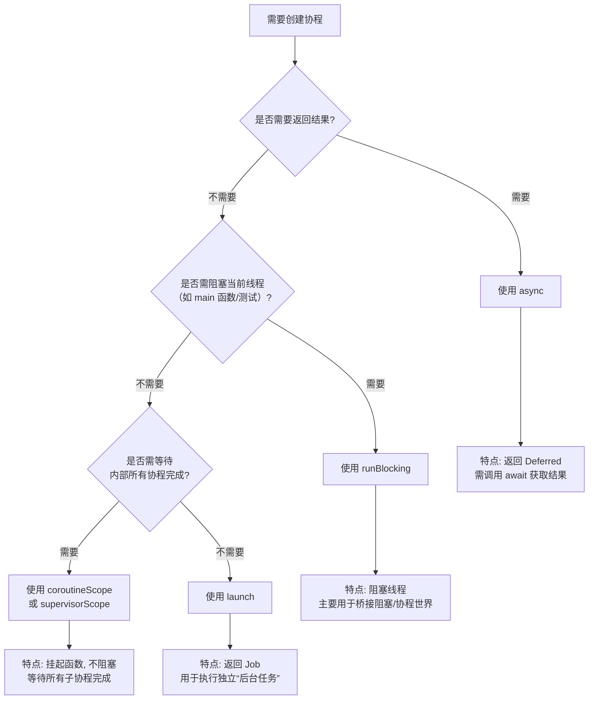

# 线程
## 线程使用规范
在 **IntelliJ IDEA 插件开发**中，线程使用有严格的规范。**错误的线程操作是插件崩溃、UI 卡死、数据不一致的最常见原因**。以下是官方推荐的线程使用规范（基于 IntelliJ Platform SDK 最佳实践）。

---

## 🧭 核心原则

> ✅ **所有 UI 操作必须在 Event Dispatch Thread (EDT) 执行**  
> ✅ **所有耗时操作（IO / 网络 / 计算）禁止在 EDT 执行**

IntelliJ 的 UI 线程 = **EDT（Event Dispatch Thread）**，也叫 **AWT 事件线程**。

---

## 🔒 线程角色划分

| 线程类型 | 能做什么 | 不能做什么 | 如何进入 |
|--------|--------|----------|--------|
| **EDT (UI 线程)** | - 修改 UI（按钮、面板）<br>- 操作 `Editor`、`Document`<br>- 添加/移除 Inlay<br>- 调用 `WriteCommandAction` | - 网络请求<br>- 文件 IO<br>- 大量计算<br>- 阻塞等待 | 默认代码执行位置<br>`invokeLater { }` |
| **后台线程 (Pooled Thread)** | - 调用 LLM API<br>- 读取文件（只读）<br>- Diff 计算<br>- JSON 解析 | - 直接访问 `Editor`<br>- 修改文档<br>- 创建 Swing 组件 | `executeOnPooledThread { }` |

---

## ✅ 正确使用方式（Kotlin 示例）

### 1. **启动后台任务（不在 UI 线程做耗时操作）**

```kotlin
ApplicationManager.getApplication().executeOnPooledThread {
    // ✅ 合法：网络请求、AI 调用、大计算
    val result = myLLM.generateCode(selectedText)

    // ❌ 非法：不能在这里更新 UI！
    // showInlay(result)

    // ✅ 正确：切回 UI 线程更新
    ApplicationManager.getApplication().invokeLater {
        showInlay(result) // 安全操作 Editor / UI
    }
}
```

---

### 2. **安全修改文档（必须在 EDT + WriteCommand）**

```kotlin
// 必须在 EDT 中调用！
ApplicationManager.getApplication().invokeLater {
    WriteCommandAction.runWriteCommandAction(project) {
        // ✅ 安全：修改文档
        editor.document.replaceString(start, end, newText)
    }
}
```

> 💡 `WriteCommandAction` 内部已确保在 EDT，但**调用它本身仍需在 EDT**。

---

### 3. **只读文档内容（可在后台线程）**

```kotlin
ApplicationManager.getApplication().executeOnPooledThread {
    // ✅ 合法：只读 document
    val text = editor.document.getText()
    val lines = text.lines()

    // 做 Diff 计算...
    val diff = computeDiff(lines, aiResponse)

    invokeLater {
        renderDiffInEditor(diff)
    }
}
```

> ⚠️ 注意：即使只读，也要确保 `editor` 对象未被 dispose（检查 `project.isDisposed`）。

---

## 🚫 常见错误 & 崩溃场景

| 错误代码 | 后果 | 修复方式 |
|--------|------|--------|
| ```kotlin executeOnPooledThread { editor.inlayModel.add(...) } ``` | `AssertionError: Access is allowed from event dispatch thread only` | 包裹 `invokeLater` |
| ```kotlin invokeLater { callLLM() } ``` | IDE 卡死（UI 线程阻塞） | 改用 `executeOnPooledThread` |
| ```kotlin WriteCommandAction.run { ... } // 在后台线程调用 ``` | 崩溃或静默失败 | 确保在 EDT 调用 |
| ```kotlin var x = 0; executeOnPooledThread { x++ }; println(x) ``` | 数据竞争（x 可能为 0） | 用 `synchronized` 或 `AtomicInteger` |

---

## 🛠️ 实用工具方法封装

```kotlin
// 安全地在后台做计算，结果回调到 UI 线程
fun <T> doAsync(
    project: Project,
    task: () -> T,
    onSuccess: (T) -> Unit
) {
    if (project.isDisposed) return
    ApplicationManager.getApplication().executeOnPooledThread {
        try {
            val result = task()
            if (!project.isDisposed) {
                ApplicationManager.getApplication().invokeLater {
                    if (!project.isDisposed) {
                        onSuccess(result)
                    }
                }
            }
        } catch (e: Exception) {
            LOG.warn("Async task failed", e)
        }
    }
}

// 使用示例
doAsync(project, 
    task = { callLLM(selectedText) },
    onSuccess = { response -> showDiff(response) }
)
```

---

## 📌 特殊情况处理

### ✅ 检查当前是否在 EDT
```kotlin
if (ApplicationManager.getApplication().isDispatchThread) {
    // 当前在 UI 线程
} else {
    // 在后台线程
}
```

### ✅ 安全地读取 PSI（需 Read Action）
```kotlin
ApplicationManager.getApplication().runReadAction {
    // 安全读取 PSI 树（即使在后台线程）
    val psiFile = PsiDocumentManager.getInstance(project).getPsiFile(document)
}
```

> 💡 `runReadAction` 可在任意线程调用，但会获取读锁。

---

## 🧪 调试技巧

1. **开启断言**：IDEA 开发模式默认开启线程检查，非法操作会立即崩溃。
2. **日志标记线程**：
   ```kotlin
   LOG.info("Running on ${Thread.currentThread().name}")
   ```
3. **使用 Async Stack Trace**（IDEA 2023.1+）：可追踪跨线程调用链。

---

## ✅ 总结：黄金法则

| 场景 | 正确做法 |
|------|--------|
| **用户点击按钮** | 默认在 EDT → 可直接读 UI，但**不要做耗时操作** |
| **调用 AI / 网络** | `executeOnPooledThread` → 结果用 `invokeLater` 回 UI |
| **修改代码** | `invokeLater` + `WriteCommandAction` |
| **读取代码** | 后台线程可用 `document.getText()`；读 PSI 用 `runReadAction` |
| **更新 UI 组件** | **永远**用 `invokeLater` 包裹 |

> 🔥 **记住**：  
> **“后台干活，前台更新；写要加锁，读要小心。”**

遵循这些规范，你的插件将稳定运行，避免 99% 的线程相关崩溃。


# 协程知识点
Kotlin 中的**线程**和**协程**是不同层次的并发处理机制。简单来说：**线程是操作系统级别的并发单位，重量级且昂贵；而协程是用户态的轻量级并发抽象，运行在线程之上，由 Kotlin 运行时管理调度。**

下图清晰地展示了两者的核心关系与调度机制：



---

### 🆚 核心关系对比

| 维度 | **线程 (Thread)** | **协程 (Coroutine)** |
| :--- | :--- | :--- |
| **创建开销** | 重（~1MB 栈内存，系统调用） | 极轻（~几十KB，用户态操作） |
| **数量上限** | 千级别（受内存/调度限制） | 十万/百万级别（理论无上限） |
| **调度方** | **操作系统内核**（抢占式） | **Kotlin 运行时**（协作式） |
| **阻塞代价** | 阻塞**整个线程**，浪费资源 | **挂起**协程，释放线程去执行其他任务 |
| **通信方式** | 共享内存（需复杂同步） | Channel、Flow、共享状态（更安全） |
| **使用场景** | CPU密集型、底层操作 | I/O密集型、高并发、异步逻辑 |

---

### 🔄 调度机制详解

#### 1. **协程调度器 (`CoroutineDispatcher`)**
调度器决定协程在哪个或哪些线程上执行。主要有四种：

| 调度器 | 用途 | 对应线程池 |
| :--- | :--- | :--- |
| **`Dispatchers.Default`** | **CPU密集型计算**（并行算法、排序） | 固定线程池（CPU核心数） |
| **`Dispatchers.IO`** | **I/O密集型操作**（网络、文件读写） | 弹性线程池（~64线程） |
| **`Dispatchers.Main`** | **UI更新**（Android、JavaFx） | 主线程/UI线程 |
| **`Dispatchers.Unconfined`** | 不指定线程（不推荐生产环境使用） | 当前线程启动，在恢复的线程继续 |

```kotlin
import kotlinx.coroutines.*

fun main() = runBlocking {
    // 在不同调度器上启动协程
    launch(Dispatchers.Default) {
        println("运行在 Default 调度器: ${Thread.currentThread().name}")
        // 适合 CPU 计算
    }
    
    launch(Dispatchers.IO) {
        println("运行在 IO 调度器: ${Thread.currentThread().name}")
        // 适合网络请求
    }
    
    withContext(Dispatchers.Default) {
        // 临时切换调度器
        println("切换到 Default 调度器执行计算")
    }
}
```

#### 2. **挂起与恢复（非阻塞式）**
这是协程最核心的机制。当协程执行到 `suspend` 函数（如 `delay`, `await`）时，它会**挂起**自身（保存状态），**释放底层线程**，而不是阻塞线程。

```kotlin
suspend fun fetchTwoData() {
    val deferred1 = async(Dispatchers.IO) { fetchData1() } // 挂起点1
    val deferred2 = async(Dispatchers.IO) { fetchData2() } // 挂起点2
    // 两个请求并发执行，线程在此期间可被其他协程使用
    val result1 = deferred1.await() // 可能挂起等待结果
    val result2 = deferred2.await()
    println("结果: $result1, $result2")
}
```

#### 3. **结构化并发与父-子关系**
协程通过**作用域 (`CoroutineScope`)** 建立父子关系，实现结构化并发：
- **取消传播**：父协程取消 → 所有子协程自动取消。
- **异常传播**：子协程异常 → 传递给父协程处理。
- **作用域生命周期**：`ViewModelScope`、`LifecycleScope` 等与组件生命周期绑定。

```kotlin
fun processUserData() {
    // 创建一个作用域
    val scope = CoroutineScope(Dispatchers.Default + SupervisorJob())
    
    scope.launch {
        // 父协程
        launch {
            // 子协程1
            delay(1000)
            println("子1完成")
        }
        launch {
            // 子协程2
            delay(500)
            println("子2完成")
        }
        // 父协程等待所有子协程完成
    }
    
    // 2秒后取消整个作用域
    Thread.sleep(2000)
    scope.cancel() // 所有子协程都会被取消
}
```

---

### 🎯 核心协作机制：挂起函数的底层原理

当协程挂起时，底层发生以下过程：
1. **状态保存**：将当前协程的局部变量、执行位置保存到**续体 (`Continuation`)** 对象。
2. **线程释放**：当前线程返回到线程池，可执行其他任务。
3. **恢复调度**：当挂起条件满足（如网络响应返回），调度器从线程池选取一个线程（**可能不是原线程**）恢复协程执行。

---

### 💡 最佳实践与选择

1. **何时用协程，何时用线程？**
    - **99%的异步场景用协程**：网络请求、数据库操作、文件IO、UI更新。
    - **少数情况用线程**：
        - 执行极度耗时的**CPU密集型计算**（考虑专用线程池）。
        - 调用**阻塞式原生库**（无法用 `suspend` 包装时）。

2. **调度器选择指南**：
   ```kotlin
   // 正确的调度器使用示例
   suspend fun processData() {
       // 步骤1: IO操作（网络、文件）
       val data = withContext(Dispatchers.IO) { fetchFromNetwork() }
       
       // 步骤2: CPU计算（解析、转换）
       val result = withContext(Dispatchers.Default) { compute(data) }
       
       // 步骤3: 更新UI
       withContext(Dispatchers.Main) { updateUI(result) }
   }
   ```

3. **避免常见错误**：
   ```kotlin
   // ❌ 错误：在默认调度器执行IO
   launch(Dispatchers.Default) {
       val data = blockingNetworkCall() // 阻塞线程！
   }
   
   // ✅ 正确：使用IO调度器或挂起函数
   launch(Dispatchers.IO) {
       val data = blockingNetworkCall() // 在专用IO线程
   }
   // 或更好的方式：
   launch {
       val data = suspendNetworkCall() // 挂起函数，不阻塞
   }
   ```

4. **调试技巧**：
   ```kotlin
   // 1. 添加协程名称便于调试
   launch(CoroutineName("网络请求协程") + Dispatchers.IO) { ... }
   
   // 2. 使用 -Dkotlinx.coroutines.debug JVM参数
   // 启动时添加此参数，线程名会显示协程信息
   ```

---

### 📊 性能对比示例

```kotlin
fun compareConcurrency() = runBlocking {
    val threadCount = 100_000
    val coroutineCount = 100_000
    
    // 测试创建大量线程（可能导致OOM或极慢）
    val threadTime = measureTimeMillis {
        val threads = List(threadCount) {
            Thread {
                Thread.sleep(10)
            }.apply { start() }
        }
        threads.forEach { it.join() }
    }
    
    // 测试创建大量协程
    val coroutineTime = measureTimeMillis {
        val jobs = List(coroutineCount) {
            launch {
                delay(10) // 模拟工作
            }
        }
        jobs.forEach { it.join() }
    }
    
    println("线程方式: ${threadTime}ms, 协程方式: ${coroutineTime}ms")
    // 典型输出: 线程方式: 5000+ms (或OOM), 协程方式: ~100ms
}
```

### 总结
- **关系**：协程是**用户态**的轻量级抽象，运行在线程之上，由 Kotlin 运行时调度。
- **调度**：通过 `Dispatcher` 决定协程的执行线程，通过**挂起/恢复**实现非阻塞并发。
- **优势**：协程通过结构化并发、轻量级和更安全的并发模型，**极大简化了异步编程**。

如果你正在设计一个具体的并发场景（例如并发网络请求、批量文件处理），我可以提供更具体的代码模式和建议。


在 Kotlin 协程中，创建协程的函数主要有 **`launch`、`async`、`runBlocking` 和 `coroutineScope`**。它们各有不同的用途和特性。

下图清晰地展示了这四种核心协程构建器的关键区别与选择逻辑：



---

### 📋 详细对比表格

| 特性 | **`launch`** | **`async`** | **`runBlocking`** | **`coroutineScope`** |
| :--- | :--- | :--- | :--- | :--- |
| **主要用途** | 启动“一劳永逸”的后台任务 | 启动需要**结果**的并发任务 | **桥接**阻塞与协程世界 | 创建**结构化并发**作用域 |
| **返回值** | `Job`（无结果） | `Deferred<T>`（将来结果） | 泛型 `T`（直接结果） | 泛型 `T`（最后表达式） |
| **异常处理** | 未捕获异常会**取消父协程** | 异常在 `await()` 时抛出 | 异常直接抛出到阻塞代码 | 异常会向上传播 |
| **是否阻塞当前线程** | ❌ 不阻塞 | ❌ 不阻塞 | ✅ **阻塞** | ❌ 不阻塞（挂起函数） |
| **是否结构化并发** | ✅ 是（需在作用域内） | ✅ 是（需在作用域内） | ✅ 是（本身是作用域） | ✅ **专为结构化设计** |

---

### 📝 各函数详细用法与示例

#### 1. **`launch`** - “发射即忘”的任务
用于启动一个不需要返回结果的协程。返回 `Job` 对象，可用于取消或等待完成。

```kotlin
import kotlinx.coroutines.*

fun main() = runBlocking {
    println("主协程开始")
    
    val job = launch {
        // 执行一个后台任务
        delay(1000)
        println("launch 任务完成")
    }
    
    println("主协程继续执行，不等待 launch")
    
    job.join() // 可选择等待任务完成
    println("主协程结束")
}
```

#### 2. **`async`** - 并发执行并获取结果
用于启动需要返回结果的并发任务。返回 `Deferred<T>`（类似 `Future`），通过 `await()` 获取结果。

```kotlin
import kotlinx.coroutines.*
import kotlin.system.*

fun main() = runBlocking {
    println("开始并发计算")
    
    // 同时启动两个异步计算
    val deferred1 = async {
        delay(500)
        println("async1 完成")
        10 + 20 // 最后一行是返回值
    }
    
    val deferred2 = async {
        delay(300)
        println("async2 完成")
        5 * 5
    }
    
    // 等待所有结果（如果某个 async 失败，await 会抛出异常）
    val result1 = deferred1.await()
    val result2 = deferred2.await()
    
    println("结果1: $result1, 结果2: $result2, 总和: ${result1 + result2}")
    
    // 或者使用 awaitAll 等待多个
    val sum = awaitAll(deferred1, deferred2).sum()
    println("总和: $sum")
}
```

#### 3. **`runBlocking`** - 阻塞式协程构建器
**阻塞当前线程**，直到内部协程全部完成。主要用于测试、`main` 函数或与阻塞代码集成。

```kotlin
import kotlinx.coroutines.*

fun main() {
    println("线程开始: ${Thread.currentThread().name}")
    
    // runBlocking 会阻塞当前线程
    val result = runBlocking {
        delay(1000) // 这里会挂起协程，但阻塞线程
        println("在 runBlocking 内: ${Thread.currentThread().name}")
        42 // 返回值
    }
    
    println("结果: $result") // 1秒后才会执行
    println("线程结束")
}
```

#### 4. **`coroutineScope`** - 结构化并发作用域
创建一个新的协程作用域，**挂起**当前协程（而非阻塞线程），等待所有子协程完成。异常会向上传播。

```kotlin
import kotlinx.coroutines.*

fun main() = runBlocking {
    println("开始处理")
    
    val result = coroutineScope {
        // 在这个作用域内可以启动多个协程
        val deferred1 = async { fetchData1() }
        val deferred2 = async { fetchData2() }
        
        // 等待所有子协程完成，然后返回结果
        "结果: ${deferred1.await()} 和 ${deferred2.await()}"
    }
    
    println(result) // 所有子协程完成后才会执行
}

suspend fun fetchData1(): String {
    delay(500)
    return "数据1"
}

suspend fun fetchData2(): String {
    delay(300)
    return "数据2"
}
```

#### 5. **`supervisorScope`** - 异常隔离的作用域
与 `coroutineScope` 类似，但子协程的**异常不会影响其他子协程**和父协程。

```kotlin
import kotlinx.coroutines.*

fun main() = runBlocking {
    supervisorScope {
        // 子协程1：会失败
        val child1 = launch {
            delay(100)
            throw RuntimeException("子协程1失败!")
        }
        
        // 子协程2：继续执行，不受影响
        val child2 = launch {
            delay(200)
            println("子协程2正常完成")
        }
        
        // 即使 child1 失败，child2 仍会执行
        delay(300)
        println("supervisorScope 完成")
    }
    
    println("父协程继续执行") // 这行会执行
}
```

---

### 🔄 组合使用示例

#### 场景：并发获取多个数据后处理
```kotlin
import kotlinx.coroutines.*
import kotlin.system.*

suspend fun fetchUserData(): String {
    return coroutineScope {
        val profile = async { fetchProfile() }
        val friends = async { fetchFriends() }
        val posts = async { fetchPosts() }
        
        // 并发执行三个请求，然后组合结果
        "Profile: ${profile.await()}, Friends: ${friends.await()}, Posts: ${posts.await()}"
    }
}

suspend fun fetchProfile(): String {
    delay(500)
    return "用户资料"
}

suspend fun fetchFriends(): String {
    delay(300)
    return "好友列表"
}

suspend fun fetchPosts(): String {
    delay(400)
    return "帖子列表"
}

// 使用示例
fun main() = runBlocking {
    val time = measureTimeMillis {
        val userData = fetchUserData()
        println("获取的数据: $userData")
    }
    println("总耗时: ${time}ms") // 约500ms（而不是300+400+500=1200ms）
}
```

---

### ⚠️ 常见错误与最佳实践

#### 错误示例
```kotlin
// ❌ 错误：在非协程作用域中直接调用 launch/async
fun wrongUsage() {
    launch { /* 编译错误！不在协程作用域内 */ }
}

// ❌ 错误：滥用 runBlocking 阻塞 UI 线程（Android）
fun onButtonClick() {
    runBlocking { // 会阻塞 UI 线程！
        val data = fetchData()
        updateUI(data)
    }
}
```

#### 正确示例
```kotlin
// ✅ 正确：在协程作用域内使用
fun correctUsage(scope: CoroutineScope) {
    scope.launch { // 在提供的协程作用域内
        val data = fetchData()
        withContext(Dispatchers.Main) {
            updateUI(data)
        }
    }
}

// ✅ 正确：使用 async 并发执行，提高效率
suspend fun loadDataConcurrently(): Pair<String, String> = coroutineScope {
    val data1 = async { fetchFromSource1() }
    val data2 = async { fetchFromSource2() }
    data1.await() to data2.await() // 并发等待
}
```

---

### 🎯 总结：如何选择？

| 场景 | 推荐构建器 | 原因 |
| :--- | :--- | :--- |
| **执行不需要结果的后台任务** | `launch` | 简单、轻量，返回 `Job` 可控 |
| **并发计算并需要结果** | `async` + `await` | 天然支持并发，结果可组合 |
| **`main` 函数或单元测试** | `runBlocking` | 防止程序提前退出 |
| **创建结构化并发作用域** | `coroutineScope` | 异常传播合理，代码结构清晰 |
| **需要异常隔离** | `supervisorScope` | 子协程失败不影响其他 |

**黄金法则**：
1. 在挂起函数内部需要启动子协程时，优先使用 **`coroutineScope`** 或 **`supervisorScope`**
2. 在业务逻辑中需要并发获取多个结果时，使用 **`async`**
3. 只是执行一个独立任务，使用 **`launch`**
4. 只在程序入口点或测试中使用 **`runBlocking`**

记住这些区别后，你可以根据具体需求选择合适的协程构建器。如果你有具体的并发场景需要实现，我可以提供更针对性的代码示例。


截至目前（2025 年 12 月），Claude（由 Anthropic 开发）本身并不直接支持与 IntelliJ IDEA 的语言服务器（Language Server）集成，因为：
Claude 是一个闭源的 LLM 服务，主要通过 Web UI、官方 App 或 API（如 Claude API）提供；
IntelliJ IDEA 使用的是 JetBrains 自研的深度代码理解引擎（基于 PSI，非标准 LSP），不原生暴露 Language Server Protocol (LSP) 接口；
Claude 官方未提供 IDE 插件（截至 2025 年，GitHub Copilot、Amazon CodeWhisperer、JetBrains AI Assistant 是主流，但无 Claude 官方插件）。

✅ 但你可以通过以下方式 间接让 Claude 利用 IDEA 的语言智能：
方案一：使用第三方插件桥接（推荐）
虽然没有官方插件，但社区有实验性项目可将 任意 LLM（包括 Claude）接入 IDEA，并手动注入上下文（模拟“使用语言服务器”的效果）。
步骤：
1. 安装支持自定义 LLM 的插件
   例如：
   [Code With Me + Custom LLM Backend](https://plugins.jetbrains.com/plugin/14896-code-with-me)（需改造）
   自研插件（见下文）

2. 在插件中调用 IDEA 的 PSI 获取精准上下文
   kotlin
   // 获取当前方法签名 + 类结构
   val psiMethod = PsiTreeUtil.getParentOfType(editor.caretModel.offset, PsiMethod::class.java)
   val context = buildString {
   append("File: ${file.name}\n")
   append("Class: ${psiClass.qualifiedName}\n")
   append("Method: ${psiMethod?.text}")
   // 添加引用、文档等
   }

3. 将上下文 + 用户问题发送给 Claude API
   kotlin
   val prompt = """
   You are an expert Java developer.
   Here is the relevant code context from IntelliJ IDEA:

$context

User question: $userQuery
""".trimIndent()

val response = claudeClient.sendMessage(prompt)
🔑 关键：不是 Claude 直接连 LSP，而是你的插件从 IDEA 提取结构化信息，再喂给 Claude。

方案二：使用 Continue（VS Code） + 远程访问 IDEA 项目（变通）

如果你愿意切换编辑器：
1. 在 VS Code 中安装 [Continue](https://continue.dev) 插件；
2. 配置 Continue 使用 Claude API（支持 anthropic.claude-3-5-sonnet 等）；
3. Continue 会自动索引项目文件，并可通过 MCP（Model Context Protocol） 调用外部工具；
4. 虽然不能直接调用 IDEA 的 PSI，但可读取源码、Git 状态等。
   ❌ 缺点：无法获得 IDEA 特有的深度语义（如 Spring 注解解析、Kotlin 协程上下文）。

方案三：等待官方或社区插件支持
JetBrains 已开放 AI Assistant 插件框架，未来可能支持 Claude（需 Anthropic 合作）；
GitHub 上已有实验性项目（如 claude-intellij-plugin），但多为 PoC，稳定性差。

🚫 为什么不能直接“使用 IDEA 自己的语言服务器”？

原因 说明
------ ------
IDEA 不实现 LSP JetBrains 使用自研 PSI（Program Structure Interface），比 LSP 更强大，但不兼容标准 LSP 客户端
Claude 无 IDE 集成 SDK Anthropic 未提供类似 GitHub Copilot 的 IDE 插件开发套件
安全限制 直接暴露语言服务器需 IPC/网络通信，存在安全风险，IDEA 默认禁止

💡 替代建议：用 JetBrains AI Assistant + Claude API（混合）

如果你有 Claude API Key，可改造 JetBrains AI Assistant 插件（开源部分）：

1. 下载 [AI Assistant 插件源码](https://github.com/JetBrains/ai-assistant-plugin)（部分开源）；
2. 修改其后端，将请求转发到 https://api.anthropic.com/v1/messages；
3. 保留 IDEA 原生上下文提取逻辑（类、方法、文档）；
4. 实现自己的 ClaudeAIService。
   ⚠️ 注意：违反 JetBrains ToS 可能导致账号封禁，仅限个人使用。

✅ 总结

目标 可行性 方案
------ -------- ------
Claude 直接调用 IDEA 语言服务器 ❌ 不可能 IDEA 无 LSP，Claude 无插件
Claude 通过插件获取 IDEA 结构化上下文 ✅ 可行 自研插件 + PSI + Claude API
在 VS Code 中用 Continue + Claude ✅ 推荐 放弃 IDEA，换编辑器
等待官方支持 ⏳ 未知 关注 Anthropic / JetBrains 动态

🔧 如果你决定自研插件，核心代码骨架如下：

kotlin
// 1. 获取当前代码上下文
val context = extractContextFromPSI(project, editor)

// 2. 调用 Claude API
val client = OkHttpClient()
val requestBody = JSON.toJSONString(mapOf(
"model" to "claude-3-5-sonnet-20241022",
"messages" to listOf(mapOf("role" to "user", "content" to "$context\n\n$question")),
"max_tokens" to 1024
))

val request = Request.Builder()
.url("https://api.anthropic.com/v1/messages")
.header("x-api-key", "YOUR_CLAUDE_KEY")
.header("anthropic-version", "2023-06-01")
.post(RequestBody.create(JSON_MEDIA_TYPE, requestBody))
.build()

val response = client.newCall(request).execute()
// 3. 显示结果到 ToolWindow

需要我提供完整的插件模板（含 Claude API 集成 + PSI 上下文提取）吗？欢迎继续提问！
